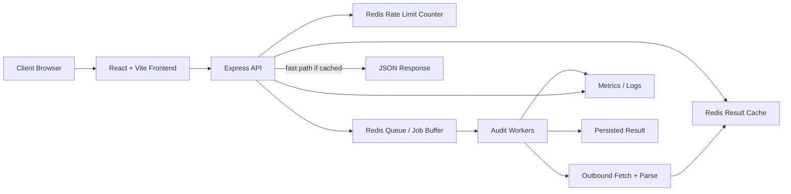

# SiteScan Pro at Scale

## Problem statement

SiteScan Pro must handle roughly 10,000 audits per day, bursts of up to 500 concurrent requests, and a customer-facing response-time SLA. The current single-node request path is fine for a demo, but at production scale it needs bounded admission, repeatable work, and explicit state placement.

## Architecture

## Components

- Frontend: React + Vite for the public UI and audit form.
- API: Express for request validation, admission control, and JSON responses.
- Redis: shared state for rate limiting, cache entries, and the job buffer.
- Worker process: separate Node process that performs outbound fetches and HTML parsing.
- Logging pipeline: Pino logs with request IDs for traceability.

## Request flow

1. The client submits a URL to `POST /api/audit`.
2. Express validates the payload with Zod and assigns a request ID.
3. The API checks the rate limit in Redis before doing any work.
4. The API checks the Redis cache.
5. If there is a fresh cache hit, it returns immediately.
6. If not, the request is admitted to a Redis-backed queue.
7. A worker claims the job, fetches the URL with a timeout, parses the page, scores it, and stores the result in Redis.
8. The client receives the result either synchronously when it finishes inside the SLA window or through a short polling/retry loop when queue pressure rises.

## Queueing strategy

The queue exists to absorb bursts without letting 500 concurrent audits hammer the upstream fetch path at once. Redis is the state store because it is already required for caching and rate limiting, so the system keeps one operational dependency instead of adding a second broker.

Admission should be bounded in two places:

- Per-client rate limiting to stop abusive traffic.
- Global worker concurrency so only a safe number of outbound fetches run at once.

For customer experience, the API should prefer the cached or immediate path. When the queue is under pressure, it should return a structured `202 Accepted` response with a request ID and a polling URL rather than letting latency explode.

## Where state lives

- Request state: in memory only for the lifetime of one request.
- Cache state: Redis with a configurable TTL.
- Rate-limit counters: Redis with a fixed window.
- Queue state: Redis list/stream or a job library backed by Redis.
- Audit history beyond the cache window: not required for the brief, so not persisted.

## SLA posture

The SLA should be protected by making the cached path the common case and the queue path the burst absorber. The API must fail fast on invalid requests, reject over-limit clients, and avoid blocking the event loop on long fetches.

## Operational shape

A practical production deployment would use two Railway services:

- `web`: the Express API and React static hosting.
- `worker`: the audit processor.

Both services share the same Redis instance. That keeps the deploy simple while still separating HTTP admission from network-heavy work.
